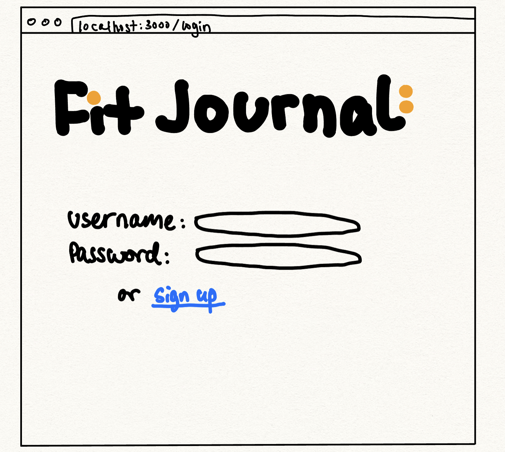
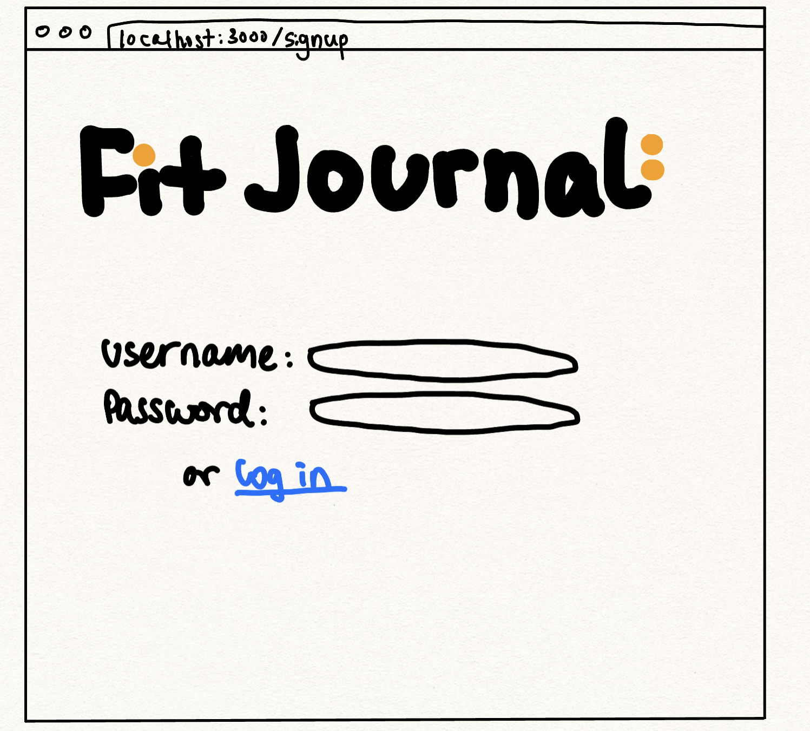
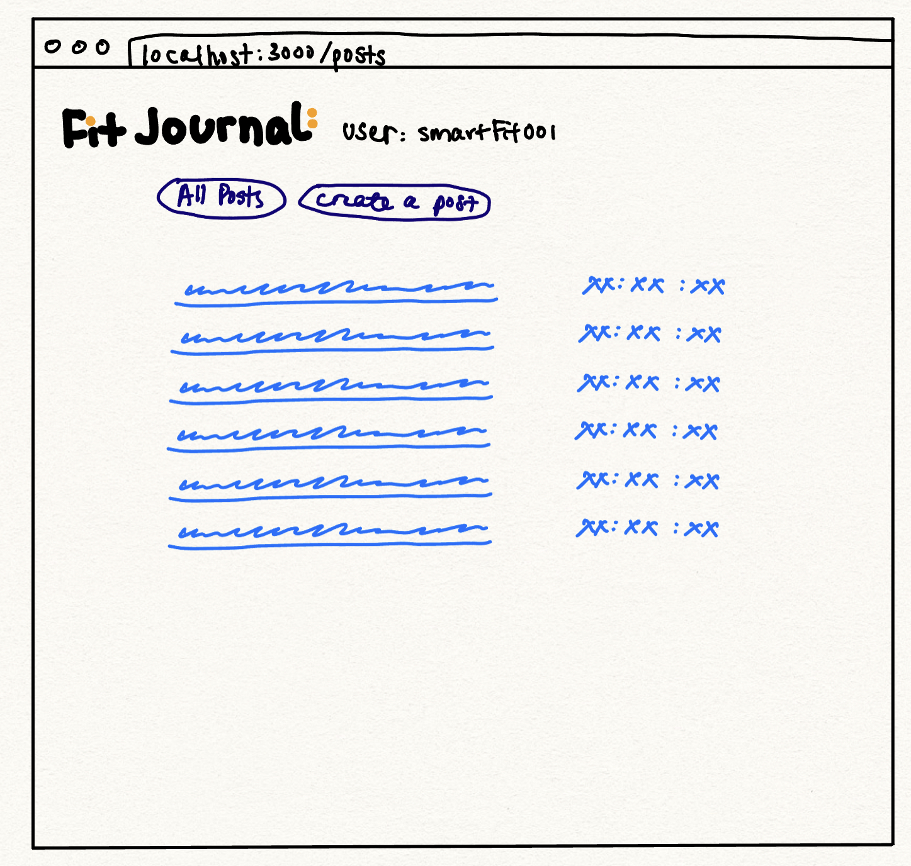
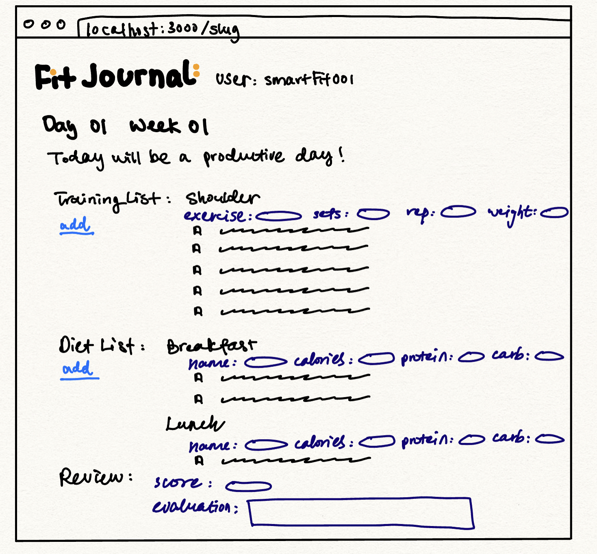
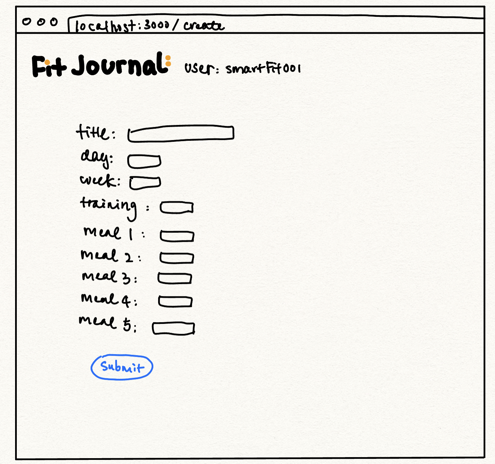
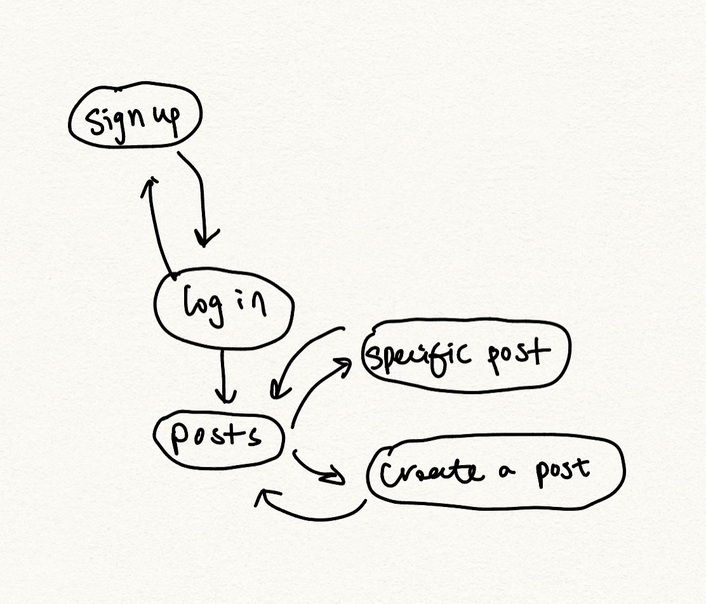

The content below is an example project proposal / requirements document. Replace the text below the lines marked "__TODO__" with details specific to your project. Remove the "TODO" lines.

(__TODO__: your project name)

#  Fit Journal 

## Overview

Fit Journal is a web application designed to help fitness enthusiasts keep track of their fitness journey. 

The app offers a range of features that allow users to create, view, and post their fitness journals, which include training and diet lists. Users can register and login to access their accounts, where they can plan their workouts for the day and cross over each exercise as they finish. In the diet list, users can plan their meals for the day and calculate the total calories. 

Additionally, there is an evaluation functionality that allows users to self-evaluate their progress for the day. 

Whether users are cutting, bulking, or maintaining their physique, Fit Journal provides an ideal and simple platform for monitoring their fitness progress and staying motivated every step of the way.


## Data Model

The application will store Users, Posts and Lists

* users can have multiple posts (via references)
* each posts can have multipe lists and a self-evaluation review (via references)
* each list can have multiple items (by embedding)


An Example User:
```javascript
{
  username: "smartFit001",
  hash: // a password hash,
  posts: // an array of references to Post documents
}
```

An Example Post with Embedded Items:
```javascript
{
  user: // a reference to a User object
  week: "1";
  day: "1";
  title: "It's gonna be a productive day!",
  lists: // an array of references to List documents
  review: //  references to Review document
  createdAt: // timestamp
}
```

An Example Training List with Embedded Items:

```javascript
{
  user: // a reference to a User object
  name: "Shoulder Workout",
  items: [
    { name: "Seated Dumbbell Press", sets: "4", reps:"6-8",intervals:"1-2 mins", checked: false},
    { name: "Lateral Raises", sets: "4", reps:"10-12",intervals:"1-2 mins", checked: true},
  ],
  createdAt: // timestamp
}
```
An Example Diet List with Embedded Items:

```javascript
{
  user: // a reference to a User object
  name: "Breakfast",
  items: [
    { name: "2 slices of whole-grain toast", calories: "200", protein:"8g",carbs:"12g", checked: false},
   { name: "3 large eggs", calories: "210", protein:"18g",carbs:"0", checked: false},
    { name: "1 medium avocado", calories: "240", protein:"3g",carbs:"12g", checked: false},
   
  ],
  createdAt: // timestamp
}
```

An Example Review:
```javascript
{
  user: // a reference to a User object
  score: "98",
  review: "It really is a very productive day, i;m proud of myself! Tomorrow I'm gonna try to swim a bit.",
  createdAt: // timestamp
}
```


## [Link to Commented First Draft Schema](db.mjs) 


## Wireframes


/login - page for logging in



/signup - page for signing up



/posts - page for all the posts from the user



/slug - page for a specific post




/create - page for create a new post



## Site map



## User Stories or Use Cases


1. as non-registered user, I can register a new account with the site
2. as a user, I can log in to the site
3. as a user, I can create a new fit journal post
4. as a user, I can view all of the journal psots I've created 
5. as a user, I can add new post with new lists
6. as a user, I can add items to an existing training list
7. as a user, I can cross off items in an existing training list
8. as a user, I can add items to an existing diet list
9. as a user, I can cross off items in an existing diet list

## Research Topics


* (5 points) Integrate user authentication
    * I'm going to be using passport for user authentication
    * And account has been made for testing; I'll email you the password
* (4 points) Perform client side form validation using a JavaScript library
    * if you put in a number that's greater than 5, an error message will appear in the dom
* (5 points) ReactJS
    * used ReactJS as the frontend framework; it's a challenging library to learn, so I've assigned it 5 points


## [Link to Initial Main Project File](app.mjs) 

(__TODO__: create a skeleton Express application with a package.json, app.mjs, views folder, etc. ... and link to your initial app.mjs)

## Annotations / References Used

(__TODO__: list any tutorials/references/etc. that you've based your code off of)

1. [passport.js authentication docs](http://passportjs.org/docs) - (add link to source code that was based on this)
2. [tutorial on react](https://www.w3schools.com/react/react_intro.asp) - (add link to source code that was based on this)

